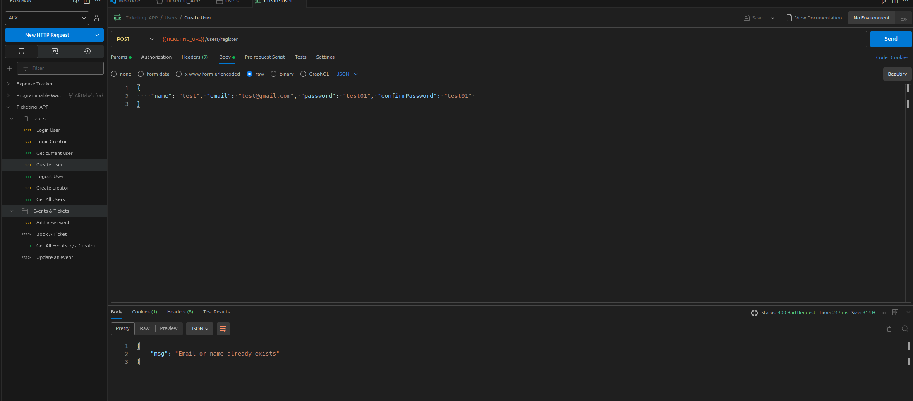
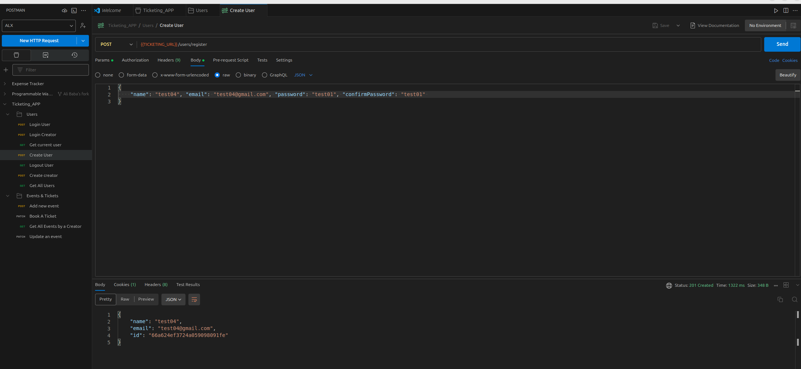

# Ticketing API

## Functionalities

```
Comprehensive custom Error Handling

User Authentication
User Functionsality
i User signup and login
ii Greator signup and login
 iv, v, vi, vii, viii, ix, x
Events & Tickets
```

## Routes

[TICKETING_URL](http://localhost:5000/api/v1/)

### http://localhost:5000/api/v1/

## Users

```
/users/register Create a new user
/users/creator/register Create a new creator(has the ability to create an event)
/users/login Login as a registered user or creator
/users/user Show the current logged-in user
/users/logout Logout the current logged-in user
```

## Events & Tickets

```
/events/event Create a new event by a creator
/events/events Get all events created by a creator only
/events Get all events created
/events/:eventId/tickets Book an event ticket created by a creator except the creator
```

## Screenshots



